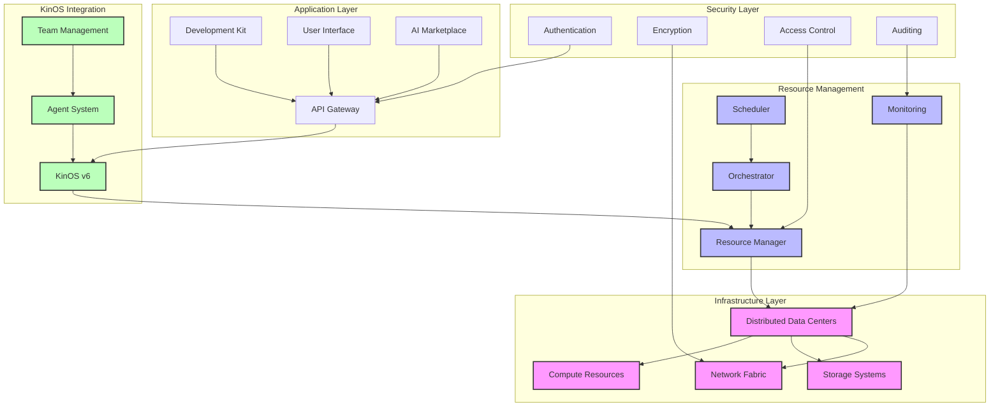

# Universal Basic Compute Architecture

## System Overview
This diagram illustrates the core architectural components and interactions of the Universal Basic Compute (UBC) system.

## Component Description

### Infrastructure Layer
- **Distributed Data Centers**: Global network of compute facilities
- **Compute Resources**: CPU, GPU, and specialized hardware
- **Storage Systems**: Distributed storage infrastructure
- **Network Fabric**: High-speed interconnect system

### Resource Management
- **Resource Manager**: Core allocation and optimization engine
- **Orchestrator**: Workload distribution and management
- **Scheduler**: Task scheduling and prioritization
- **Monitoring**: System health and performance tracking

### KinOS Integration
- **KinOS v6**: Advanced AI orchestration system
- **Agent System**: Autonomous AI agent framework
- **Team Management**: Collaborative AI team coordination

### Security Layer
- **Authentication**: Identity verification system
- **Encryption**: Data protection mechanisms
- **Access Control**: Resource access management
- **Auditing**: System activity logging

### Application Layer
- **API Gateway**: Primary interface for external systems
- **Development Kit**: Tools for integration and development
- **User Interface**: Management and monitoring interface
- **AI Marketplace**: Platform for AI service exchange

## Key Features
1. Decentralized Architecture
2. Scalable Resource Management
3. Secure Multi-tenant Operation
4. Real-time Monitoring
5. Automated Optimization
6. Fault Tolerance
7. Dynamic Scaling

## Design Principles
- Modularity
- Scalability
- Security
- Reliability
- Efficiency
- Transparency
- Interoperability

## Implementation Notes
- Built on modern cloud-native technologies
- Implements industry standard protocols
- Supports hybrid deployment models
- Enables seamless integration with existing systems
- Provides comprehensive monitoring and analytics
- Ensures data privacy and security compliance
