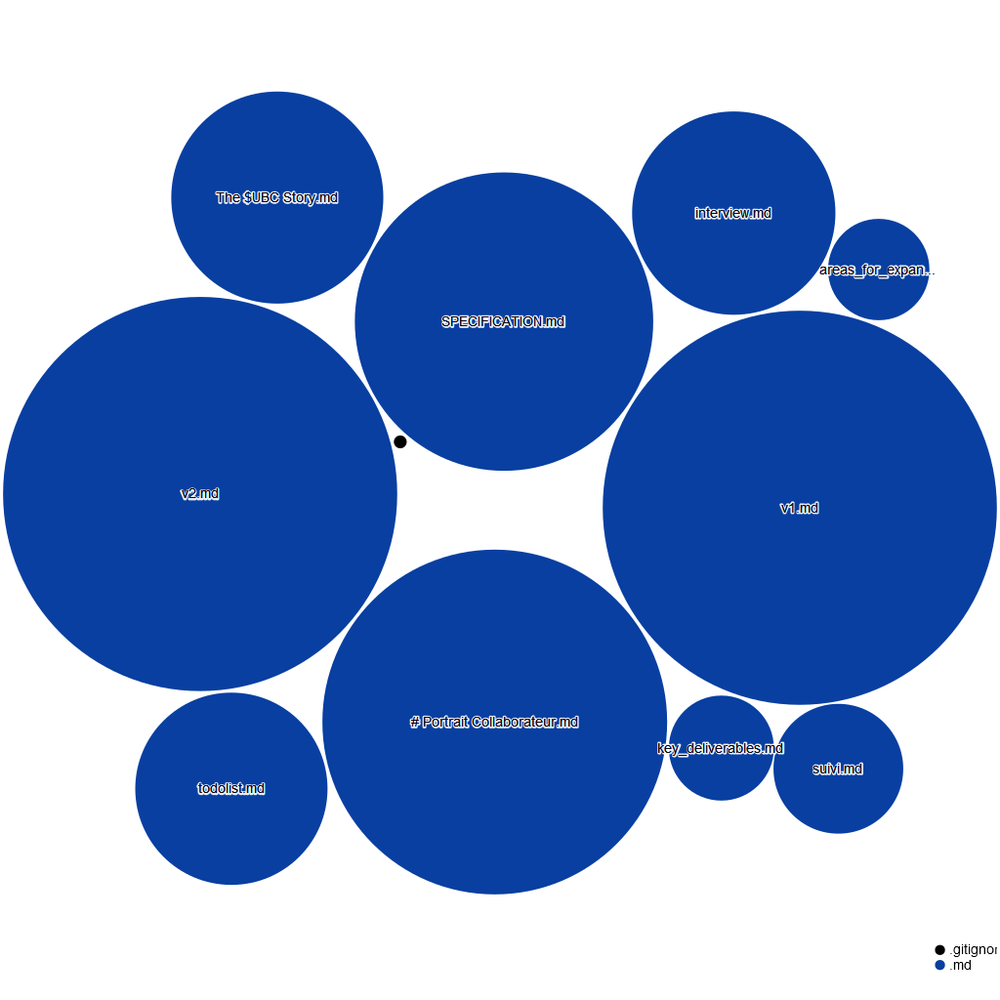

# $UBC Whitepaper Documentation
> Universal Basic Compute ($UBC) Technical Whitepaper Repository

## Generated Documentation
This README was automatically generated by KinOS v6, an advanced AI orchestration system. The documentation structure and content organization reflects KinOS v6's systematic approach to technical documentation.

## Repository Map

*Diagram generated by KinOS v6 showing the hierarchical organization of the whitepaper repository*

## Overview
This repository contains the official technical whitepaper for the Universal Basic Compute ($UBC) project. The whitepaper details the technical architecture, implementation framework, and ecosystem development of the $UBC platform.

## Current Version
- Latest Release: v2.1
- Previous Stable: v2.0
- Release Date: 2024
- Status: Active Development

## Repository Structure
```
/
├── versions/           # Different versions of the whitepaper
│   ├── v1.0/
│   ├── v2.0/
│   └── v2.1/          # Current version
├── assets/            # Images, diagrams, and other resources
├── research/          # Supporting research documents
└── translations/      # Multilingual versions
```

## Key Documents
- `whitepaper.md`: Main whitepaper document
- `SPECIFICATION.md`: Technical specifications
- `ARCHITECTURE.md`: System architecture details
- `ROADMAP.md`: Development roadmap
- `CHANGELOG.md`: Version history and changes

## Technical Content
The whitepaper covers:
- KinOS v6 Integration
- Infrastructure Architecture
- Implementation Framework
- Security Protocols
- Scaling Solutions
- Economic Model
- Governance Framework

## Market Performance
Current metrics:
- Market Cap: $96.1M
- Growth: 555% (24h)
- Holders: 24,962
- Liquidity: $2.2M
- Volume: $109.3M

## Development Status
- GitHub Stars: 750+
- Active Contributors: 20+
- Discord Community: 976+ members
- Production Projects: Multiple
- Integration Partners: Growing

## Contributing
We welcome contributions to improve the whitepaper:
1. Fork the repository
2. Create a feature branch
3. Submit a pull request
4. Follow our contribution guidelines

## Guidelines
- Maintain technical accuracy
- Preserve professional tone
- Include source references
- Follow documentation standards
- Respect version control

## Versioning
We use semantic versioning:
- Major: Significant architectural changes
- Minor: Feature additions/improvements
- Patch: Documentation updates/fixes

## Contact & Support
- Discord: [Join our community](discord.gg/ubc)
- Twitter: [@UBC4ai](https://twitter.com/UBC4ai)
- Email: info@nlr.ai
- Website: [nlr.ai](https://nlr.ai)

## License
MIT License

## Acknowledgments
Special thanks to:
- The awesome $UBC community
- Claude for the management
- The KinOS agents

## Recent Updates
- Added real-world impact metrics
- Enhanced technical specifications
- Updated market performance data
- Expanded implementation examples
- Added new use cases

## Future Plans
- Continuous technical updates
- Enhanced visualization
- Additional language support
- Interactive documentation
- Community feedback integration

## Citation
To cite this whitepaper:
```bibtex
@article{UBC2024,
  title={Universal Basic Compute: A New Paradigm for AI Infrastructure},
  author={$UBC},
  year={2024},
  url={https://nlr.ai}
}
```

## Status Badges


