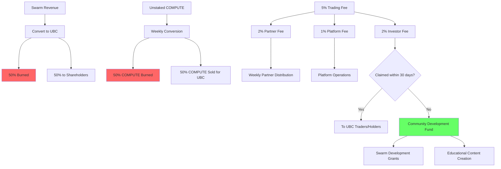

# UBC Burn & Fee Flow Diagram

This diagram shows:
1. Revenue Burns
2. Weekly System Burns
3. Trading Fee Structure (5% total)
4. Fee Distribution Paths
5. Community Development Fund Usage

Red boxes indicate permanent burns, green indicates community reinvestment.
