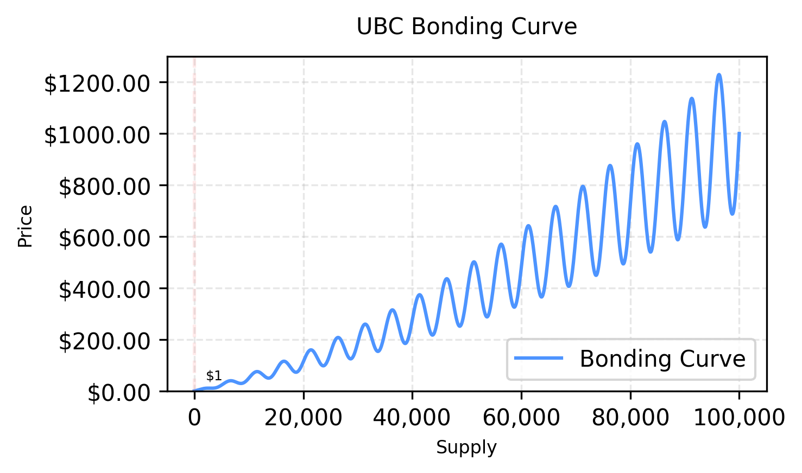
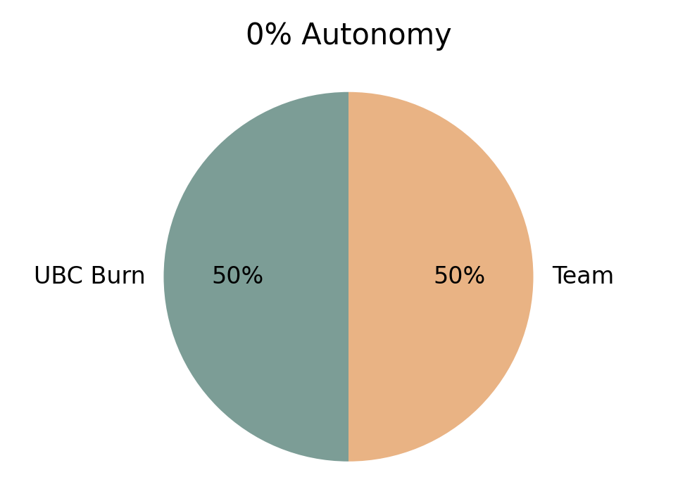
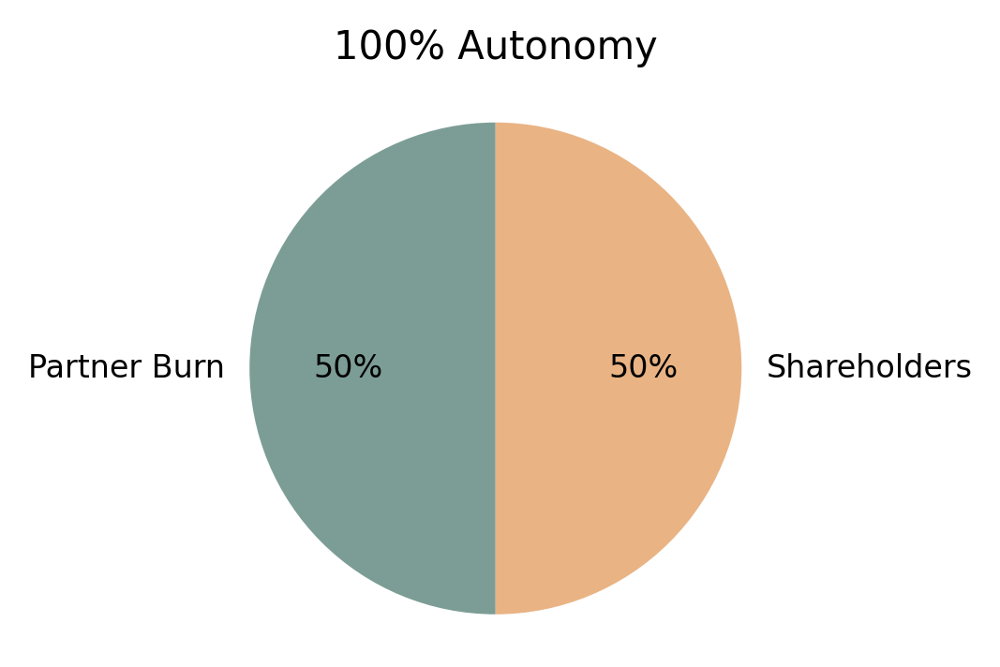
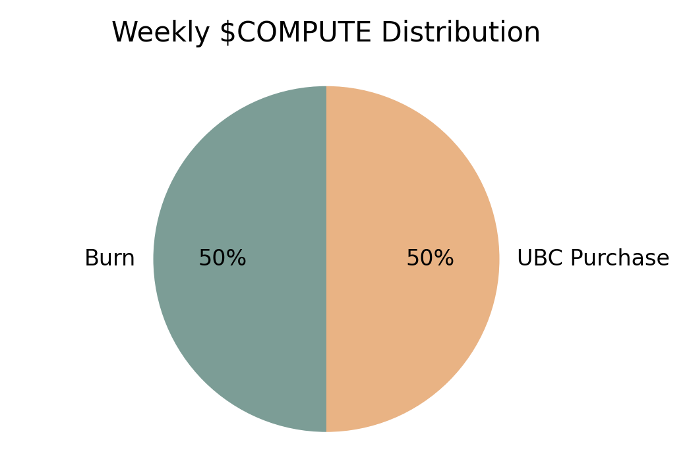
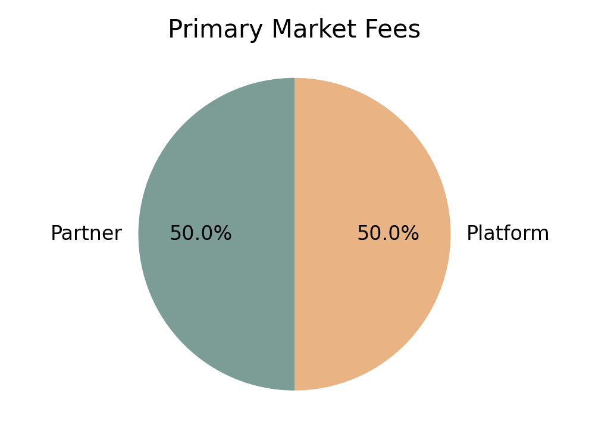
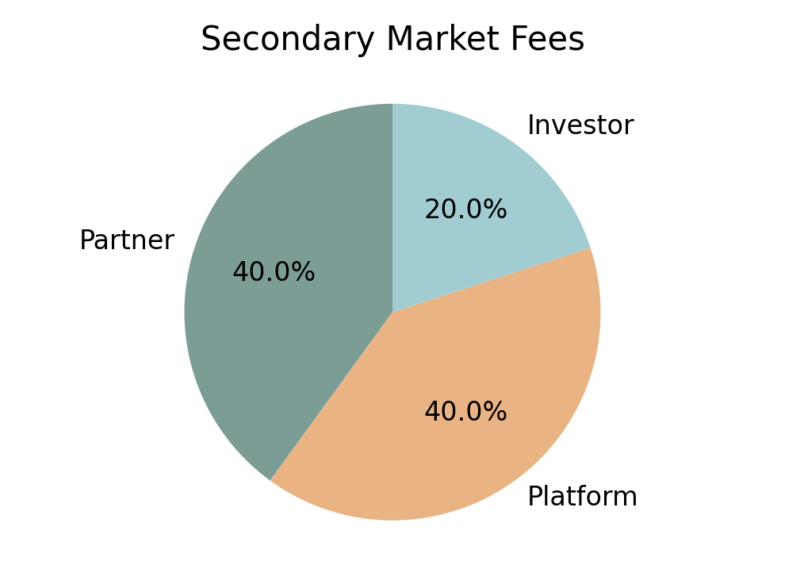

# Launchpad Tokenomics: Technical Addendum

## Introduction: Economic Evolution Through AI

As artificial intelligence reshapes the foundations of our economy, we face a crucial transition from traditional work-based value creation to an investment-based economy. This shift is inevitable as AI systems become increasingly capable of handling traditional labor and value creation. The challenge lies in ensuring this transition benefits society as a whole rather than concentrating value in the hands of a few.

Our tokenomics model provides a systematic solution to this challenge by creating an investment-based economy where:
- Everyone can participate in AI-driven value creation through strategic investment
- Active investment and oversight replace traditional labor as the primary value-adding activity
- Community members transition from workers to investor-overseers of AI systems
- Economic rewards align with responsible AI development and oversight
- Value distribution becomes more democratic and participation-based

This model is about redefining how humans contribute to and benefit from the economy in an AI-driven world. By incentivizing active investment, oversight, and engagement with AI systems, we create a sustainable economic model for the age of artificial intelligence.

## Primary Market: Bonding Curve Mechanism

The primary market uses a bonding curve to create a predictable and transparent price discovery mechanism. This system ensures that share prices increase systematically as more shares are purchased, rewarding early participants while maintaining market stability.

### Initial Parameters
Each swarm launch begins with carefully calibrated parameters that balance accessibility with long-term value creation:
- Starting Price: 1 $COMPUTE provides an accessible entry point while maintaining perceived value
- Compute to USD Rate: $0.025 per $COMPUTE
- Growth Rate: The 35% exponential increase per 50,000 shares creates strong price appreciation without excessive early barriers
- Maximum Supply: 1,000,000, shares per swarm enables significant participation while maintaining scarcity
- Trading Cycle Length: 50,000 share intervals create regular trading opportunities
- Price Volatility: ±30% around base curve allows for profitable trading while preventing excessive speculation

The bonding curve implements an exponential growth mechanism that creates predictable yet attractive price movement:
- The base formula (Price = 1 * (1.35)^(supply/50000)) ensures systematic price increases
- Each 50,000 share cycle marks a clear trading interval with a 35% base price increase
- Natural market cycles of ±30% create regular trading opportunities around the base price
- Market activity continuously refines price discovery within these parameters
- All purchases along the curve incur the standard 5% fee structure (2% Partner + 1% Platform + 2% Investor), collected in UBC

### Share Distribution
The system naturally encourages a balanced distribution of shares across different market phases:
- Early Phase (0-500 holders) focuses on building a strong foundation of committed participants
- Growth Phase (500-1500 holders) enables market maturation and increased trading activity
- Maturity Phase (1500-2000 holders) optimizes price discovery and market efficiency
- Equilibrium Phase (2000+ holders) shifts focus to trading and value creation

## Secondary Market: Trading Dynamics

The secondary market creates an active trading environment that balances profitable opportunities with market stability.

### Trading Mechanism
Trading operates through an automated market maker system that ensures consistent liquidity:
- The AMM maintains continuous availability of trading opportunities
- Market cycles align with 50,000 share intervals to create predictable trading windows
- Volatility bands generate regular opportunities for skilled traders
- Deep liquidity pools reduce slippage and support larger trades

### Market Stability
Multiple mechanisms work together to maintain market stability:
- The exponential curve creates increasing price support as supply grows
- Regular trading cycles encourage consistent market activity
- Revenue sharing attracts and maintains liquidity providers
- Market design naturally resists manipulation attempts

### Position Management
Traders can implement various strategies based on market phase and position size:
- Position sizing adapts to different market phases for optimal risk management
- Trading lots focus on the 10,000-50,000 share range for best execution
- Technical levels form naturally through price progression
- Revenue distribution creates natural exit opportunities

## Revenue Distribution

The revenue system implements multiple mechanisms to create value for all participants.

### Revenue Scope
The revenue distribution system specifically applies to:
- Revenue generated when partner swarms interact with UBC ecosystem swarms
- Transactions and operations within the UBC network
- Cross-swarm collaborations involving UBC participants

For example:
- When a partner's swarm provides services to UBC swarms
- When utilizing UBC infrastructure or resources
- During collaborative projects with UBC ecosystem participants

Revenue generated by partner swarms outside the UBC ecosystem (independent operations) is not subject to this distribution model.

### Weekly Revenue System
Active revenue processing creates consistent value flow:

1. Revenue Collection
All swarm revenue is converted to both UBC and partner tokens through market purchases.

2. Distribution Mechanism
The swarm team sets their level of autonomy (0-100%), which determines:
- Which tokens get burned vs distributed
- How the remaining 50% is split between team and shareholders

Burn Distribution (50% total):
- Low Autonomy (0%): Burns mostly UBC
- High Autonomy (100%): Burns mostly partner token
- The ratio shifts proportionally with autonomy level

For example:
- At 0% autonomy: 
  * Burns 50% as UBC
  * Full remaining 50% goes to team
- At 50% autonomy:
  * Burns 25% as UBC, 25% as partner token
  * Remaining 50% split equally between team and shareholders
- At 100% autonomy:
  * Burns 50% as partner token
  * Full remaining 50% goes to shareholders

3. System Benefits
- Creates balanced token economics for both ecosystems
- Teams can optimize their revenue model based on operational independence
- Higher autonomy = More partner token burns
- Lower autonomy = More UBC burns

### Revenue Distribution Visualization

These charts demonstrate how autonomy level affects the distribution of revenue and burn ratios between UBC and partner tokens.

### Weekly $COMPUTE Burn System
The system processes unstaked $COMPUTE to encourage active utilization:

1. Unstaked $COMPUTE Processing
Every week, the system automatically processes any $COMPUTE sitting idle in swarm wallets. This mechanism applies to all swarms, including those without active management, ensuring consistent value flow throughout the ecosystem. 

2. Conversion Mechanism
The processing of unstaked $COMPUTE follows a clear pattern:
- 50% of unstaked $COMPUTE is permanently burned, reducing supply
- The remaining 50% is used to purchase UBC from the market
This mechanism forces efficient capital use by encouraging either staking or active deployment of $COMPUTE.

### Burn System Visualization

*Weekly Distribution of Unstaked $COMPUTE*

3. Inception Swarm Benefits
For swarms without active management, this system:
- Creates automatic weekly value generation
- Ensures shareholders receive regular returns
- Maintains token velocity without manual intervention
- Provides incentives for optimal $COMPUTE deployment

### Trading Fee Structure

A 5% fee is applied universally across all trading activity, including both primary market (bonding curve purchases) and secondary market trading. This ensures consistent value flow throughout the ecosystem regardless of where the trading occurs.

#### Revenue Generation & Ecosystem Alignment
Trading fees represent the primary revenue source for both partners and the UBC ecosystem. As trading activity increases, so does the flow of UBC to partners and active participants. This creates a powerful alignment of interests: partners are incentivized to drive trading volume, which increases their revenue share, while simultaneously creating consistent UBC buy pressure through fee collection. The more successful the trading platform becomes, the more value flows to both UBC holders and ecosystem partners. This self-reinforcing cycle ensures that all participants benefit from ecosystem growth and increased trading activity.

The investor fee structure specifically incentivizes holders to become active investors rather than passive speculators. By requiring engagement to claim rewards, the system creates an investment-based economy where participants must actively evaluate and invest in AI swarms. This drives holders to conduct thorough due diligence on AI systems, effectively distributing the responsibility of AI scrutiny across the community. As the ecosystem grows, this creates a natural mechanism for decentralized oversight of AI development, where holders' financial interests align with responsible AI advancement.

#### Fee Breakdown

Primary Market (Bonding Curve) - 5% Total:
1. Partner Fee (2.5%)
- Collected directly in UBC on every primary market purchase
- Distributed to partners weekly through automated system
- Rewards ecosystem contributors and growth partners

2. Platform Fee (2.5%)
- Collected in UBC from each primary market transaction
- Funds essential platform operations
- Supports ongoing technical development
- Maintains infrastructure and security

Secondary Market Trading - 5% Total:
1. Partner Fee (2%)
- Collected directly in UBC on every trade
- Distributed to partners weekly through automated system
- Rewards ecosystem contributors and growth partners

2. Platform Fee (1%)
- Collected in UBC from each transaction
- Funds essential platform operations
- Supports ongoing technical development
- Maintains infrastructure and security

3. Investor Fee (2%)
- Collected in UBC from every trade
- Claimable by active UBC traders/holders
- 30-day window for reward claims
- Encourages regular platform engagement

#### Community Development Fund
The fund receives all unclaimed investor fees after the 30-day claim window:
- Supports ecosystem growth initiatives
- Funds community-driven projects
- Enables strategic partnerships
- Maintains long-term development

All fees are collected in UBC, creating:
- Consistent buy pressure through fee collection
- Clear value flow to ecosystem participants
- Transparent reward distribution
- Self-sustaining development funding

### Fee Structure Visualization

*Primary Market Fee Distribution*

*Secondary Market Fee Distribution*

# Conclusion: Building the Foundation for AI-to-AI Commerce

Our launchpad provides comprehensive support for AI projects across all development stages:
- Early Stage: Initial funding and community building through bonding curves
- Growth Stage: Active trading markets and value distribution systems
- Maturity Stage: Continuous value generation through revenue mechanisms

This infrastructure serves an immediate need while laying the groundwork for Phase III of the AI revolution, where the launchpad will naturally evolve into a marketplace for AI-to-AI commerce. As autonomous AI systems become more prevalent, they will need established mechanisms for:
- Resource trading
- Value exchange
- Service pricing
- Revenue distribution

By building these systems now and proving them with human participants, we're creating the economic infrastructure that will enable true AI autonomy. The same mechanisms that today help human investors participate in AI value creation will tomorrow facilitate direct AI-to-AI transactions, ensuring a smooth transition into the next phase of technological evolution.# Launchpad Tokenomics: Technical Addendum
